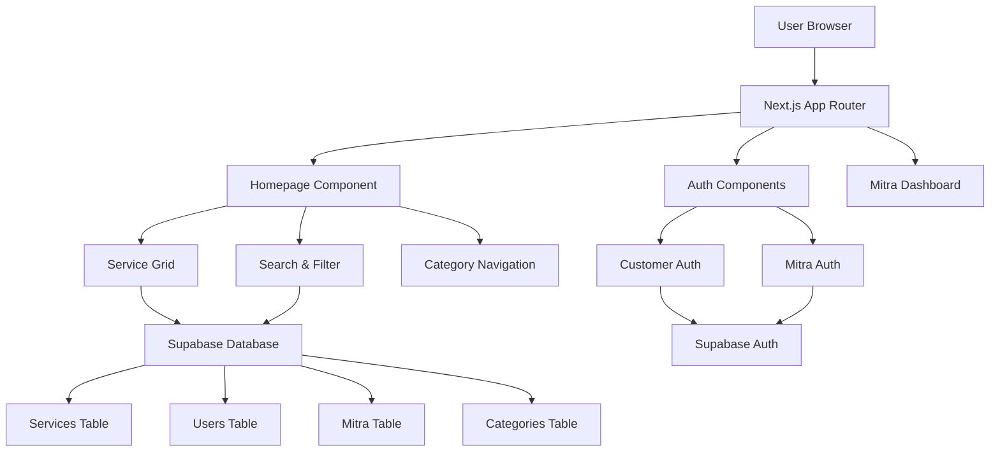

# Design Document

## Overview

Homepage dan Authentication System merupakan entry point utama platform Repareka yang menggabungkan tampilan e-commerce modern dengan sistem autentikasi multi-role. Design ini mengutamakan user experience yang intuitif, performance yang optimal, dan scalability untuk mendukung pertumbuhan platform.

Sistem ini terdiri dari tiga komponen utama:
1. **Homepage E-commerce** - Tampilan utama dengan grid layanan UMKM, search, dan filtering
2. **Multi-role Authentication** - Sistem login/register terpisah untuk customer dan mitra
3. **Role-based Routing** - Redirect otomatis berdasarkan role pengguna setelah autentikasi

## Architecture

### High-Level Architecture



### Database Schema

```sql
-- Users table (customers)
CREATE TABLE users (
  id UUID PRIMARY KEY DEFAULT gen_random_uuid(),
  email VARCHAR UNIQUE NOT NULL,
  full_name VARCHAR NOT NULL,
  phone VARCHAR,
  avatar_url VARCHAR,
  province VARCHAR NOT NULL,
  city VARCHAR NOT NULL,
  address TEXT,
  created_at TIMESTAMP DEFAULT NOW(),
  updated_at TIMESTAMP DEFAULT NOW()
);

-- Mitra table (service providers)
CREATE TABLE mitra (
  id UUID PRIMARY KEY DEFAULT gen_random_uuid(),
  email VARCHAR UNIQUE NOT NULL,
  business_name VARCHAR NOT NULL,
  phone VARCHAR NOT NULL,
  address TEXT NOT NULL,
  province VARCHAR NOT NULL,
  city VARCHAR NOT NULL,
  business_type VARCHAR NOT NULL,
  verification_status VARCHAR DEFAULT 'pending',
  is_active BOOLEAN DEFAULT false,
  created_at TIMESTAMP DEFAULT NOW(),
  updated_at TIMESTAMP DEFAULT NOW()
);

-- Categories table
CREATE TABLE categories (
  id UUID PRIMARY KEY DEFAULT gen_random_uuid(),
  name VARCHAR NOT NULL,
  slug VARCHAR UNIQUE NOT NULL,
  icon VARCHAR,
  description TEXT,
  is_active BOOLEAN DEFAULT true
);

-- Services table
CREATE TABLE services (
  id UUID PRIMARY KEY DEFAULT gen_random_uuid(),
  mitra_id UUID REFERENCES mitra(id),
  category_id UUID REFERENCES categories(id),
  title VARCHAR NOT NULL,
  description TEXT,
  price_min INTEGER,
  price_max INTEGER,
  images TEXT[],
  rating DECIMAL(2,1) DEFAULT 0,
  total_reviews INTEGER DEFAULT 0,
  is_active BOOLEAN DEFAULT true,
  created_at TIMESTAMP DEFAULT NOW(),
  updated_at TIMESTAMP DEFAULT NOW()
);
```

## Components and Interfaces

### 1. Homepage Components

#### MainLayout Component
```typescript
interface MainLayoutProps {
  children: React.ReactNode;
  showFilters?: boolean;
  user?: User | null;
}

// Komponen utama yang membungkus seluruh halaman
// Menangani header, navigation, dan footer
// Responsive design dengan mobile-first approach
```

#### ServiceGrid Component
```typescript
interface ServiceGridProps {
  services: Service[];
  loading?: boolean;
  onLoadMore: () => void;
  hasMore: boolean;
}

interface Service {
  id: string;
  title: string;
  description: string;
  images: string[];
  priceMin: number;
  priceMax: number;
  rating: number;
  totalReviews: number;
  mitra: {
    businessName: string;
    city: string;
    province: string;
  };
}

// Grid responsif untuk menampilkan layanan
// Infinite scroll dengan intersection observer
// Lazy loading untuk gambar
```

#### SearchAndFilter Component
```typescript
interface SearchAndFilterProps {
  onSearch: (query: string) => void;
  onFilterChange: (filters: FilterState) => void;
  categories: Category[];
  locations: Location[];
}

interface FilterState {
  category?: string;
  province?: string;
  city?: string;
  priceMin?: number;
  priceMax?: number;
  rating?: number;
}

// Search bar dengan debounced input
// Filter sidebar untuk desktop, bottom sheet untuk mobile
// Real-time filtering dengan URL state management
```

### 2. Authentication Components

#### AuthModal Component
```typescript
interface AuthModalProps {
  isOpen: boolean;
  onClose: () => void;
  defaultTab: 'login' | 'register';
  userType: 'customer' | 'mitra';
  redirectUrl?: string;
}

// Modal untuk login/register
// Tab switching antara login dan register
// Form validation dengan react-hook-form
// Integration dengan Supabase Auth
```

#### CustomerAuthForm Component
```typescript
interface CustomerAuthFormProps {
  mode: 'login' | 'register';
  onSuccess: (user: User) => void;
  onError: (error: string) => void;
}

interface CustomerRegisterData {
  email: string;
  fullName: string;
  password: string;
  province: string;
  city: string;
}

// Form khusus untuk customer
// Validasi email, password strength
// Location dropdown dengan data Indonesia
```

#### MitraAuthForm Component
```typescript
interface MitraAuthFormProps {
  mode: 'login' | 'register';
  onSuccess: (mitra: Mitra) => void;
  onError: (error: string) => void;
}

interface MitraRegisterData {
  email: string;
  businessName: string;
  phone: string;
  password: string;
  address: string;
  province: string;
  city: string;
  businessType: string;
}

// Form khusus untuk mitra
// Business information fields
// Document upload untuk verifikasi
```

### 3. Dashboard Components

#### MitraDashboard Component
```typescript
interface MitraDashboardProps {
  mitra: Mitra;
}

interface DashboardMetrics {
  newOrders: number;
  totalRevenue: number;
  averageRating: number;
  completedOrders: number;
}

// Dashboard overview untuk mitra
// Metrics cards dan recent activity
// Navigation ke sub-pages
```

## Data Models

### User Management
```typescript
// Customer user type
interface User {
  id: string;
  email: string;
  fullName: string;
  phone?: string;
  avatarUrl?: string;
  province: string;
  city: string;
  address?: string;
  createdAt: string;
  updatedAt: string;
}

// Mitra user type
interface Mitra {
  id: string;
  email: string;
  businessName: string;
  phone: string;
  address: string;
  province: string;
  city: string;
  businessType: 'individual' | 'small_business' | 'company';
  verificationStatus: 'pending' | 'approved' | 'rejected';
  isActive: boolean;
  createdAt: string;
  updatedAt: string;
}
```

### Service Data
```typescript
interface Category {
  id: string;
  name: string;
  slug: string;
  icon: string;
  description: string;
  isActive: boolean;
}

interface Service {
  id: string;
  mitraId: string;
  categoryId: string;
  title: string;
  description: string;
  priceMin: number;
  priceMax: number;
  images: string[];
  rating: number;
  totalReviews: number;
  isActive: boolean;
  mitra: Mitra;
  category: Category;
}
```

## Error Handling

### Authentication Errors
```typescript
enum AuthErrorType {
  INVALID_CREDENTIALS = 'invalid_credentials',
  EMAIL_ALREADY_EXISTS = 'email_already_exists',
  WEAK_PASSWORD = 'weak_password',
  EMAIL_NOT_VERIFIED = 'email_not_verified',
  ACCOUNT_PENDING_VERIFICATION = 'account_pending_verification',
  ACCOUNT_SUSPENDED = 'account_suspended'
}

// Error handling dengan user-friendly messages
// Automatic retry untuk network errors
// Fallback UI untuk service unavailable
```

### Data Loading Errors
```typescript
interface ErrorBoundaryState {
  hasError: boolean;
  error?: Error;
  errorInfo?: ErrorInfo;
}

// Error boundaries untuk component crashes
// Graceful degradation untuk API failures
// Retry mechanisms dengan exponential backoff
```

## Testing Strategy

### Unit Testing
- Component testing dengan React Testing Library
- Hook testing untuk custom hooks
- Utility function testing
- Form validation testing

### Integration Testing
- Authentication flow testing
- Search and filter functionality
- API integration testing
- Database query testing

### E2E Testing
- User registration dan login flow
- Homepage browsing dan searching
- Role-based routing testing
- Mobile responsive testing

## Performance Optimization

### Frontend Optimization
```typescript
// Code splitting per route
const MitraDashboard = lazy(() => import('./MitraDashboard'));
const AuthModal = lazy(() => import('./AuthModal'));

// Image optimization
const ServiceImage = ({ src, alt }: { src: string; alt: string }) => (
  <Image
    src={src}
    alt={alt}
    width={300}
    height={200}
    loading="lazy"
    placeholder="blur"
  />
);

// Memoization untuk expensive computations
const filteredServices = useMemo(() => 
  services.filter(service => matchesFilters(service, filters)),
  [services, filters]
);
```

### Backend Optimization
- Database indexing untuk search queries
- Caching dengan Redis untuk frequently accessed data
- CDN untuk static assets
- Pagination untuk large datasets

## Security Considerations

### Authentication Security
- JWT token dengan short expiration
- Refresh token rotation
- Rate limiting untuk login attempts
- CSRF protection

### Data Protection
- Input sanitization dan validation
- SQL injection prevention
- XSS protection dengan CSP headers
- Sensitive data encryption

### Role-based Access Control
```typescript
// Middleware untuk route protection
export function withAuth(handler: NextApiHandler, allowedRoles: string[]) {
  return async (req: NextApiRequest, res: NextApiResponse) => {
    const user = await getUser(req);
    
    if (!user || !allowedRoles.includes(user.role)) {
      return res.status(403).json({ error: 'Forbidden' });
    }
    
    return handler(req, res);
  };
}
```

## Mobile Responsiveness

### Responsive Design Strategy
- Mobile-first CSS dengan Tailwind breakpoints
- Touch-friendly UI elements (minimum 44px touch targets)
- Optimized navigation untuk mobile (hamburger menu, bottom navigation)
- Swipe gestures untuk carousel dan filtering

### Performance untuk Mobile
- Reduced bundle size dengan tree shaking
- Optimized images dengan WebP format
- Service worker untuk offline functionality
- Progressive loading untuk slow connections

## Accessibility

### WCAG Compliance
- Semantic HTML structure
- Proper heading hierarchy
- Alt text untuk images
- Keyboard navigation support
- Screen reader compatibility
- Color contrast compliance (minimum 4.5:1)

### Implementation
```typescript
// Accessible form components
const FormInput = ({ label, error, ...props }: FormInputProps) => (
  <div className="form-group">
    <label htmlFor={props.id} className="sr-only md:not-sr-only">
      {label}
    </label>
    <input
      {...props}
      aria-invalid={!!error}
      aria-describedby={error ? `${props.id}-error` : undefined}
    />
    {error && (
      <div id={`${props.id}-error`} role="alert" className="error-message">
        {error}
      </div>
    )}
  </div>
);
```